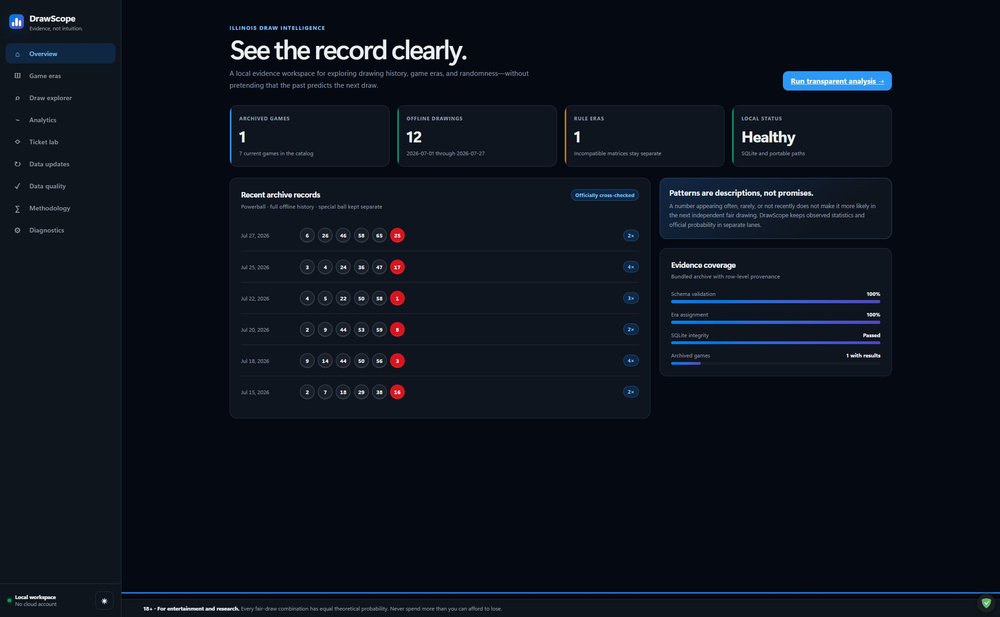
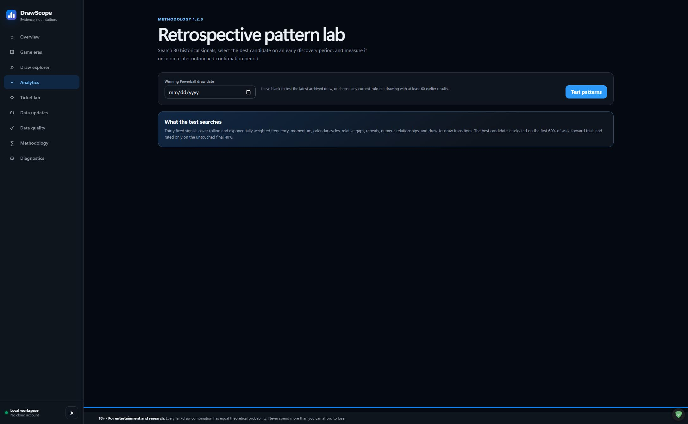
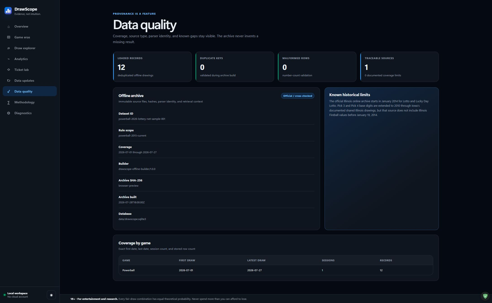
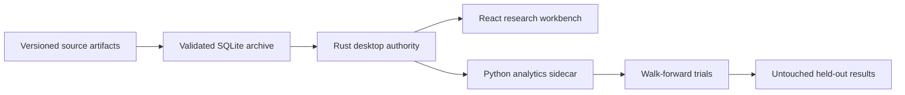

# DrawScope

[](https://github.com/NouraldinFarge/drawscope/actions/workflows/ci.yml)
[](https://github.com/NouraldinFarge/drawscope/actions/workflows/codeql.yml)
[](https://github.com/NouraldinFarge/drawscope/releases)
[](LICENSE)

**A local-first Windows research workbench for exploring lottery archives and testing historical patterns without pretending they predict future draws.**

Active development · 2026 · Version 0.6.4

DrawScope turns a large, messy draw archive into an auditable desktop workflow. It combines a React interface, a Rust/Tauri desktop authority, a Python analytics sidecar, versioned JSON contracts, and a bundled SQLite archive. The retrospective lab uses walk-forward evaluation and a held-out test segment so a pattern is measured on unseen historical draws instead of being rewarded for fitting the data that created it.

**Try it:** [Download the latest verified Windows release](https://github.com/NouraldinFarge/drawscope/releases/latest) · [Review source](https://github.com/NouraldinFarge/drawscope) · [Verify methodology limits](docs/KNOWN-LIMITATIONS.md)

> Historical patterns are descriptive research, not winning probabilities or betting advice.

## Product preview



| Retrospective analytics | Data-quality evidence |
| --- | --- |
|  |  |



## What it demonstrates

- **Leakage-resistant evaluation:** hide a target draw, rebuild every signal only from earlier results, rank candidates on the first 60% of trials, then measure the selected recipe once on the untouched final 40%.
- **Reproducible data lineage:** record source URL, SHA-256 identity, parser version, archive year, validation status, and duplicate outcome for every imported artifact.
- **Local-first architecture:** keep analysis and user data on the machine; the desktop authority owns storage, validation, and process boundaries.
- **Cross-language contracts:** validate the React, Rust, and Python boundary with versioned schemas and contract fixtures.
- **Portable Windows delivery:** build a movable executable plus analytics sidecar, validate it from renamed paths containing spaces, and reject installer-shaped artifacts.

## Product highlights

- Search and page through 41,598 bundled results across Powerball, Mega Millions, Illinois Lotto, Lucky Day Lotto, Pick 3, and Pick 4.
- Compare 30 fixed frequency, momentum, calendar, gap, numeric-relationship, and transition signals.
- Run as many as 250 walk-forward trials with explicit train/test separation.
- Import lawfully obtained Illinois archive pages through a validation-first review flow.
- Preserve user data and configuration when the bundled seed is upgraded.
- Rebuild the offline database from cached, hashed source artifacts.

## Architecture

| Layer | Responsibility |
| --- | --- |
| `apps/desktop` | React 19 interface and Tauri 2 desktop shell |
| `apps/desktop/src-tauri` | Rust commands, SQLite authority, migrations, and sidecar lifecycle |
| `engines/drawscope-engine` | Python analytics and reproducible research routines |
| `packages/contracts` | Versioned schemas, shared types, fixtures, and boundary tests |
| `tools` | Offline-database, release, and verification automation |
| `docs` | Source research, methodology, and operating decisions |

## Run locally

Prerequisites: Windows x64, Node 24+, pnpm 9.15, Rust 1.88, Python 3.12, `uv`, and Microsoft Edge WebView2.

```powershell
pnpm install
uv sync --project engines/drawscope-engine --all-groups
pnpm verify
cargo test --workspace
pnpm dev
```

## Data and methodology integrity

The Draw explorer reads the bundled SQLite archive directly. `tools/build_offline_database.py` can rebuild it from cached, hashed artifacts and refresh approved national sources with `--refresh`.

The application does not automate Lottery.net requests. Its published terms prohibit data mining and harvesting, so DrawScope accepts saved pages through an explicit user-controlled import instead. See [`docs/SOURCE-RESEARCH.md`](docs/SOURCE-RESEARCH.md) for the inspected page map and compliant update design.

The retrospective lab's bounded 0–49 confidence value describes evidence of a repeatable historical ranking advantage. It is deliberately not represented as a chance of winning.

Third-party data retains its own terms. See [`docs/DATA-NOTICE.md`](docs/DATA-NOTICE.md) for the code/data licensing boundary and [`docs/SOURCE-RESEARCH.md`](docs/SOURCE-RESEARCH.md) for provenance.

## Verification and portable release

`pnpm verify` runs formatting, linting, TypeScript checks, contract tests, and UI tests. `cargo test --workspace` covers the Rust authority, while the Python project carries its own test suite.

Double-click `BUILD-LATEST.bat` to restore locked dependencies, run the frontend/contract/Python/Rust gates, bundle the offline database, validate the portable result, create a ZIP, and transactionally refresh `active-build/`. The release pipeline never invokes a Tauri installer target.

Future version tags are also built on GitHub's Windows runner from the tagged source. That workflow publishes the portable ZIP, SHA-256 checksum, SPDX SBOM, and GitHub artifact-provenance attestation.

## Development approach

AI agents assisted with research, implementation, and iteration. I retained ownership of product direction, architecture, technical review, testing, safety boundaries, data-source decisions, and release approval. Generated suggestions were treated as untrusted until reviewed and verified against the repository's automated gates.

See [`ROADMAP.md`](ROADMAP.md), [`CONTRIBUTING.md`](CONTRIBUTING.md), and [`SECURITY.md`](SECURITY.md) for current priorities and project policies.

## License

MIT — see [`LICENSE`](LICENSE).
