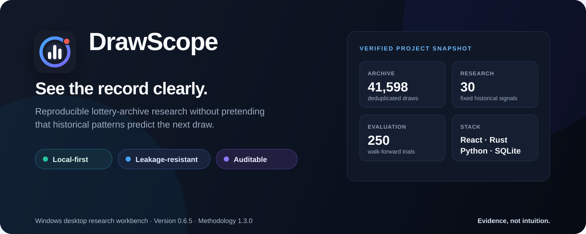
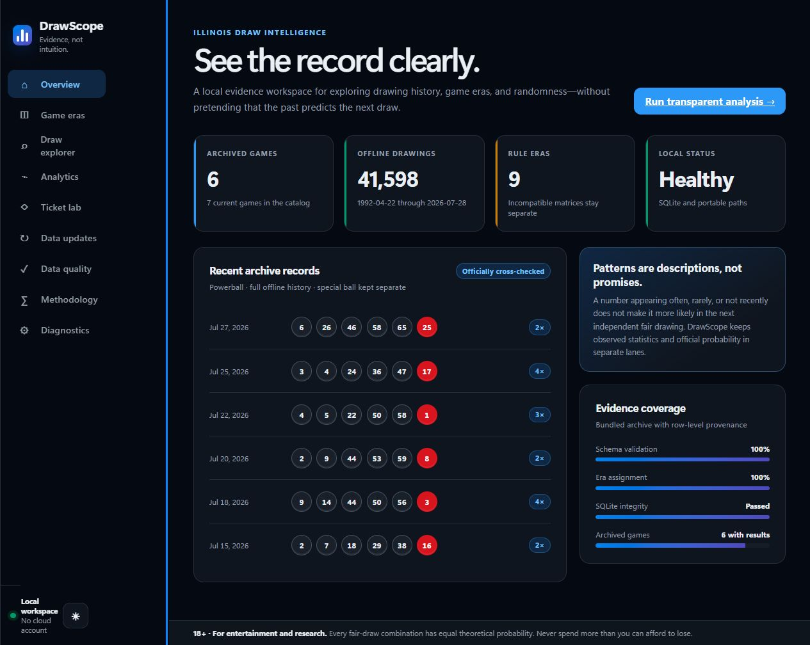
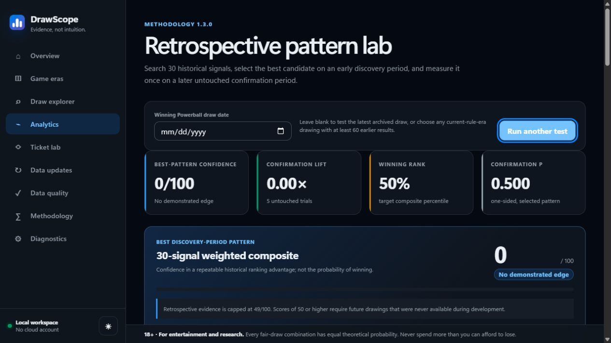
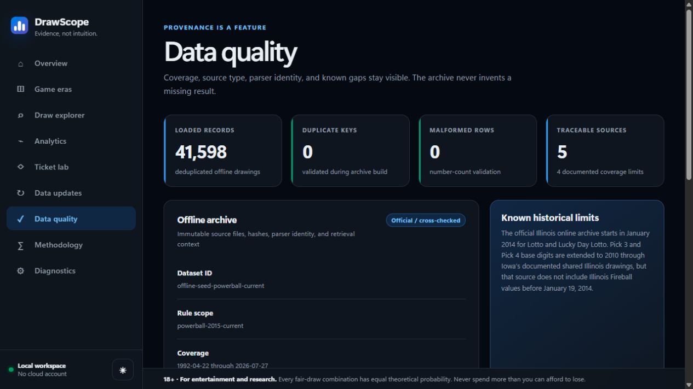
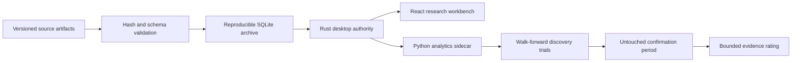

<p align="center">
  
</p>

<p align="center">
  <a href="https://github.com/NouraldinFarge/drawscope/actions/workflows/ci.yml"></a>
  <a href="https://github.com/NouraldinFarge/drawscope/actions/workflows/codeql.yml"></a>
  <a href="https://github.com/NouraldinFarge/drawscope/releases/latest"></a>
  
  
  <a href="LICENSE"></a>
</p>

<p align="center">
  <strong>Explore the record. Test the story. Keep the limits visible.</strong>
</p>

<p align="center">
  <a href="https://github.com/NouraldinFarge/drawscope/releases/latest"><strong>Download DrawScope for Windows</strong></a>
  ·
  <a href="#verify-the-download">Verify the ZIP</a>
  ·
  <a href="docs/README.md">Browse the evidence</a>
  ·
  <a href="docs/KNOWN-LIMITATIONS.md">Read the limits</a>
</p>

> DrawScope is a retrospective research workbench. It does not predict winning numbers, improve lottery odds, or provide betting advice.

## Why DrawScope exists

Lottery archives make an unusually clear test bed for responsible analytics: the data is familiar, the outcomes are independently recorded, and apparent patterns are easy to overstate. DrawScope turns that problem into an auditable Windows desktop workflow.

The application combines a React interface, a Rust/Tauri desktop authority, a Python analytics sidecar, strict JSON contracts, and a bundled SQLite archive. A pattern must be selected on an earlier discovery period and evaluated on a later untouched period; the target draw never participates in the score used to rank it.

| At a glance | Evidence |
| --- | --- |
| **Archive** | 41,598 deduplicated draws across six games, with source identities and known gaps retained |
| **Research design** | 30 fixed signals · up to 250 walk-forward trials · 60/40 discovery/confirmation split |
| **Privacy** | Local SQLite storage · no account · no telemetry · no cloud analytics |
| **Delivery** | Portable Windows x64 ZIP · SHA-256 checksum · SPDX SBOM · GitHub provenance attestation |
| **Product boundary** | Historical confidence is capped below 50/100 and is never presented as a winning probability |

## Product tour

These images are refreshed from the current `0.6.5` interface. The browser preview uses a deterministic display fixture while its archive totals and provenance summary come from the committed, hash-checked offline manifest. See the [visual provenance note](docs/images/README.md).

### 1. See archive health before interpreting a pattern



### 2. Test a historical claim without letting the target leak into selection



### 3. Inspect provenance, coverage, hashes, and known gaps



## How the evidence flows



The Rust layer owns persistence, validation, migrations, file boundaries, and sidecar lifecycle. Python receives a bounded request and returns a strictly validated result. React renders that evidence only after both the TypeScript and Rust boundaries accept it.

## What makes the analysis defensible

1. **Rules stay era-specific.** Draws from incompatible number matrices are never silently mixed.
2. **Every trial moves forward through time.** Signals for a target use only draws that happened earlier.
3. **Selection and confirmation are separate.** The strongest discovery-period strategy is chosen once, then measured on later untouched trials.
4. **Ties are outcome-independent.** Neutral ranks and deterministic SHA-256 cutoff ordering remove lower-number and winning-number bias.
5. **Confidence describes evidence, not luck.** The 0–49 score summarizes historical stability; exact jackpot odds remain in a separate lane.

[Read the full methodology](docs/METHODOLOGY.md) · [Inspect the contract boundary](docs/CONTRACTS.md) · [Review the v0.6.5 integrity audit](docs/AUDIT-REPORT-0.6.5.md)

## Verified archive snapshot

| Game | Coverage | Draws | Sessions |
| --- | ---: | ---: | ---: |
| Powerball | 1992-04-22 → 2026-07-27 | 3,813 | 1 |
| Mega Millions | 2002-05-17 → 2026-07-24 | 2,522 | 1 |
| Illinois Lotto | 2014-01-20 → 2026-07-27 | 1,960 | 1 |
| Lucky Day Lotto | 2014-01-19 → 2026-07-28 | 9,147 | 2 |
| Pick 3 | 2010-01-01 → 2026-07-28 | 12,078 | 2 |
| Pick 4 | 2010-01-01 → 2026-07-28 | 12,078 | 2 |

Two isolated frozen-source rebuilds produced the same 41,394,176-byte SQLite database:

```text
SHA-256  89a9370d4dcbba7a6ca22e218e4ed6ba6ff1a960b5c1247f3f3f4a0a4569662f
```

The archive records source URLs, retrieval context, file sizes, SHA-256 identities, parser identity, verification status, and documented gaps. Third-party data retains its own terms; review the [data notice](docs/DATA-NOTICE.md) and [source research](docs/SOURCE-RESEARCH.md) before redistributing it.

## Get the Windows app

1. Open the [latest release](https://github.com/NouraldinFarge/drawscope/releases/latest).
2. Download `DrawScope-v0.6.5-windows-x64-portable.zip` and its `.sha256` file.
3. Verify, extract to a writable folder, and run `launch-portable.bat`.

### Verify the download

```powershell
$expected = (Get-Content .\DrawScope-v0.6.5-windows-x64-portable.zip.sha256).Split()[0]
$actual = (Get-FileHash .\DrawScope-v0.6.5-windows-x64-portable.zip -Algorithm SHA256).Hash.ToLowerInvariant()
if ($actual -ne $expected) { throw "DrawScope archive checksum mismatch" }
```

Requirements: Windows x64 and Microsoft Edge WebView2. The portable build is not Authenticode-signed yet, so Windows may show a reputation warning; verify the checksum and release provenance before running it.

## Build and verify from source

Prerequisites: Windows x64, Node 24+, pnpm 9.15, Rust 1.88, Python 3.12, `uv`, and Microsoft Edge WebView2.

```powershell
pnpm install --frozen-lockfile
uv sync --project engines/drawscope-engine --frozen --all-groups
pnpm verify
uv run --project engines/drawscope-engine pytest
cargo test --locked --workspace
pnpm dev
```

`BUILD-LATEST.bat` performs the locked restore, TypeScript/React/Python/Rust gates, two byte-compared offline-database rebuilds, portable-path health checks, ZIP generation, and transactional `active-build/` promotion. It does not build an installer.

## Repository map

| Path | Responsibility |
| --- | --- |
| [`apps/desktop`](apps/desktop) | React 19 interface and Tauri 2 desktop shell |
| [`apps/desktop/src-tauri`](apps/desktop/src-tauri) | Rust commands, SQLite authority, migrations, and sidecar lifecycle |
| [`engines/drawscope-engine`](engines/drawscope-engine) | Python analytics and leakage-resistant research routines |
| [`packages/contracts`](packages/contracts) | Versioned schemas, shared types, and cross-language fixtures |
| [`data`](data) | Source catalog, immutable artifacts, manifests, and offline archive evidence |
| [`tools`](tools) | Database reconstruction and release automation |
| [`docs`](docs/README.md) | Methodology, architecture, provenance, security, testing, and audit trail |

## Documentation paths

- **Understand the product:** [documentation hub](docs/README.md), [responsible use](docs/RESPONSIBLE-USE.md), [known limitations](docs/KNOWN-LIMITATIONS.md)
- **Review the research:** [methodology](docs/METHODOLOGY.md), [source research](docs/SOURCE-RESEARCH.md), [database reconstruction](docs/DATABASE.md)
- **Review the engineering:** [architecture](docs/ARCHITECTURE.md), [contracts](docs/CONTRACTS.md), [testing](docs/TESTING.md), [function inventory](docs/FUNCTION-INVENTORY.md)
- **Operate or assess risk:** [runbooks](docs/RUNBOOKS.md), [security model](docs/SECURITY.md), [dependency policy](DEPENDENCY_POLICY.md), [accessibility](docs/ACCESSIBILITY.md)

## Contributing and support

Use the structured issue forms for reproducible bugs, bounded feature proposals, or archive/provenance discrepancies. Read [`CONTRIBUTING.md`](CONTRIBUTING.md) before opening a pull request and [`SUPPORT.md`](SUPPORT.md) for installation and usage help. Suspected vulnerabilities belong in [private vulnerability reporting](https://github.com/NouraldinFarge/drawscope/security/advisories/new), not a public issue.

## Development disclosure

AI tools assisted with research, implementation suggestions, and repetitive refactoring. Nouraldin Farge retained ownership of product direction, architecture, source-policy decisions, validation criteria, code review, testing, safety boundaries, and release approval. AI output was treated as untrusted until it passed repository review and automated verification.

## License and citation

DrawScope code is available under the [MIT License](LICENSE). Data licensing is separate and documented in the [data notice](docs/DATA-NOTICE.md). Academic and research references can use [`CITATION.cff`](CITATION.cff).
