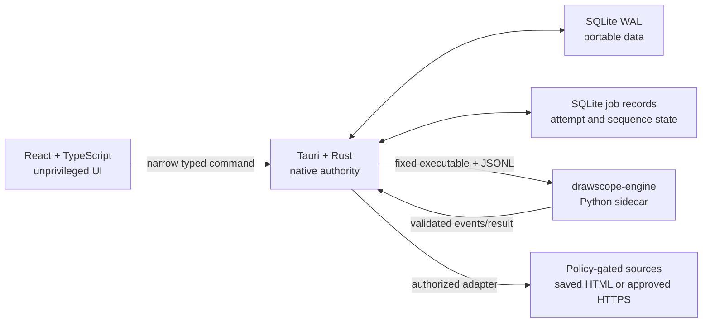

# System and folder architecture

## System boundaries



React owns presentation, navigation, form drafts, and accessibility. Rust owns validation, authorization, portable paths, the database, jobs, sidecar lifecycle, event validation, network policy, and redacted errors. Python owns analytical calculations and receives only job-scoped validated values.

## Workspace tree

```text
workspace/
├── BUILD-LATEST.bat              one-click Windows entry
├── BUILD-LATEST.ps1              release orchestration
├── VERSION                       authoritative version
├── Cargo.toml                    Rust workspace
├── package.json                  pnpm command surface
├── pnpm-workspace.yaml
├── apps/desktop/
│   ├── src/                      feature-first React UI
│   └── src-tauri/
│       ├── capabilities/         least-privilege window scope
│       ├── migrations/           transactional SQLite schema
│       └── src/                  command facade, storage, paths, engine
├── packages/contracts/
│   ├── schemas/v1/               canonical JSON Schema
│   ├── examples/                 valid and invalid fixtures
│   ├── src/                      Zod/TypeScript adapter
│   └── tests/                    equivalence validation
├── engines/drawscope-engine/
│   ├── src/drawscope_engine/     Pydantic protocol and analytics
│   └── tests/                    deterministic analytical fixtures
├── data/
│   ├── game-catalog.json         verified configuration
│   ├── source-catalog.json       provider policy and annual feed map
│   ├── archive-freshness-policy.json machine-readable refresh thresholds
│   ├── offline-seed.sqlite3      validated, bundled drawing archive
│   ├── offline-database-manifest.json hashes, coverage, and known gaps
│   ├── raw/                      hashed source artifacts used by the builder
│   └── fixtures/                 source-attributed test data
├── config/                       user-owned portable settings
├── examples/                     version-bound packaged analysis evidence
├── release/                      portable and installer support resources
├── scripts/                      presentation synchronization and site build
├── site/                         GitHub Pages template, styles, and guided tour
├── tools/                        archive, evidence, freshness, and release checks
├── docs/                         specification and runbooks
├── output/                       generated development output
├── runtime/                      development-local state
└── temp/                         guarded temporary build data
```

## Job records

The current analysis path stores durable job ID, attempt ID, state, monotonic sequence,
request hash, and timestamps in SQLite. The engine performs the bounded 250-draw,
30-signal walk-forward pattern test inside that job. It selects a candidate only from
the first 60% of those targets, freezes it, then evaluates it on the final untouched
40%. The resulting confidence score describes historical evidence and is capped at 49
until a future-draw prospective protocol exists. The job does not create separate
artifact files.

At startup, Rust verifies the bundled seed database, runs SQLite `quick_check`, merges
a changed seed transactionally, and preserves user imports. The analysis command reads
the complete current Powerball era from SQLite and records canonical job and attempt
IDs. Saved-page source imports use one short transaction per page and content hashes
for restart-safe idempotency.

## Runtime paths

In portable and installed release builds, the executable's parent is the only runtime
root. The NSIS resource map deliberately produces the same sibling layout as the ZIP,
so storage and sidecar resolution do not fork by delivery format. DrawScope creates only
`config/`, `data/`, `logs/`, `cache/`, `runtime/`, `licenses/`, and the fixed
`imports/lottery-net/` inbox under that root. Debug builds use `workspace/` as their root.
Relative child paths reject absolute, parent, root, and prefix components; existing
controlled directories reject symlinks. The uninstaller removes known application
resources while the guarded release test requires the writable user database to remain.
