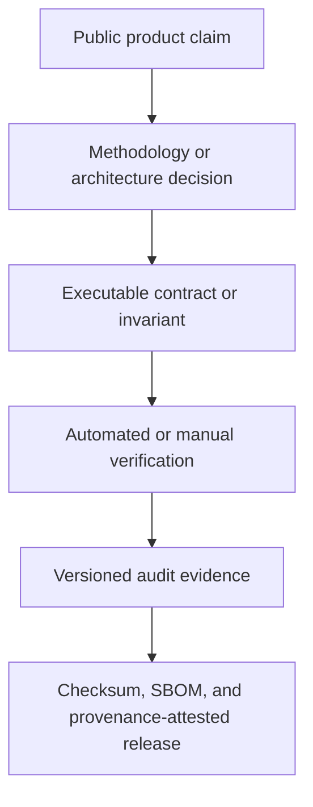

# DrawScope documentation

This directory is the evidence trail behind the product-facing claims in the root [`README`](../README.md). Start with the path that matches what you need.

## Choose a path

| If you want to… | Start here | Then inspect |
| --- | --- | --- |
| Understand the product boundary | [`RESPONSIBLE-USE.md`](RESPONSIBLE-USE.md) | [`KNOWN-LIMITATIONS.md`](KNOWN-LIMITATIONS.md) |
| Review the statistical design | [`METHODOLOGY.md`](METHODOLOGY.md) | [`AUDIT-REPORT-0.6.5.md`](AUDIT-REPORT-0.6.5.md) |
| Verify the archive and sources | [`DATABASE.md`](DATABASE.md) | [`SOURCE-RESEARCH.md`](SOURCE-RESEARCH.md), [`DATA-NOTICE.md`](DATA-NOTICE.md) |
| Understand the implementation | [`ARCHITECTURE.md`](ARCHITECTURE.md) | [`CONTRACTS.md`](CONTRACTS.md), [`FUNCTION-INVENTORY.md`](FUNCTION-INVENTORY.md) |
| Reproduce verification | [`TESTING.md`](TESTING.md) | [`RUNBOOKS.md`](RUNBOOKS.md), [`STANDARDS-COMPLIANCE.md`](STANDARDS-COMPLIANCE.md) |
| Follow a worked analysis | [`CASE-STUDY.md`](CASE-STUDY.md) | [`../examples/powerball-retrospective-v0.6.5/README.md`](../examples/powerball-retrospective-v0.6.5/README.md) |
| Ship or maintain a release | [`DISTRIBUTION.md`](DISTRIBUTION.md) | [`MAINTENANCE.md`](MAINTENANCE.md), [`RUNBOOKS.md`](RUNBOOKS.md) |
| Assess operational risk | [`SECURITY.md`](SECURITY.md) | [`ACCESSIBILITY.md`](ACCESSIBILITY.md), [`../DEPENDENCY_POLICY.md`](../DEPENDENCY_POLICY.md) |

## Trust map

| Evidence type | Location | What it establishes |
| --- | --- | --- |
| Source identity and coverage | [`../data/offline-database-manifest.json`](../data/offline-database-manifest.json) | Exact source artifacts, hashes, retrieval context, coverage, and documented gaps |
| Research protocol | [`METHODOLOGY.md`](METHODOLOGY.md) | Temporal splits, fixed signals, tie handling, confidence semantics, and limitations |
| Cross-language contract | [`CONTRACTS.md`](CONTRACTS.md) | React ↔ Rust ↔ Python request/result validation |
| Test surface | [`TESTING.md`](TESTING.md) | TypeScript, React, Python, Rust, database, packaging, and manual checks |
| Release audit | [`AUDIT-REPORT-0.6.5.md`](AUDIT-REPORT-0.6.5.md) | Version-specific results and unresolved manual gates |
| Packaged analytical result | [`../examples/powerball-retrospective-v0.6.5/README.md`](../examples/powerball-retrospective-v0.6.5/README.md) | A complete result bound to the packaged app/sidecar boundary and archive identity |
| Visual provenance | [`images/README.md`](images/README.md) | How the public screenshots were produced and what they do—and do not—show |

## Document index

### Product and research

- [`RESPONSIBLE-USE.md`](RESPONSIBLE-USE.md) — intended use and anti-prediction boundary
- [`METHODOLOGY.md`](METHODOLOGY.md) — statistical design and interpretation
- [`CASE-STUDY.md`](CASE-STUDY.md) — guided, evidence-linked analysis narrative
- [`KNOWN-LIMITATIONS.md`](KNOWN-LIMITATIONS.md) — current technical and research limitations
- [`DATA-NOTICE.md`](DATA-NOTICE.md) — code/data licensing boundary
- [`SOURCE-RESEARCH.md`](SOURCE-RESEARCH.md) — source investigation and compliant update design
- [`DATABASE.md`](DATABASE.md) — schema, reconstruction, integrity, and upgrade behavior

### Engineering and operations

- [`ARCHITECTURE.md`](ARCHITECTURE.md) — component ownership and data flow
- [`CONTRACTS.md`](CONTRACTS.md) — schema and sidecar protocol
- [`FUNCTION-INVENTORY.md`](FUNCTION-INVENTORY.md) — complete named-function inventory
- [`TESTING.md`](TESTING.md) — automated and manual verification matrix
- [`SECURITY.md`](SECURITY.md) — trust boundaries and defensive controls
- [`ACCESSIBILITY.md`](ACCESSIBILITY.md) — accessibility target and release review
- [`RUNBOOKS.md`](RUNBOOKS.md) — build, release, recovery, and incident procedures
- [`DISTRIBUTION.md`](DISTRIBUTION.md) — portable/installer packaging, signing, and publication gates
- [`MAINTENANCE.md`](MAINTENANCE.md) — freshness, dependency, presentation, and release cadence
- [`STANDARDS-COMPLIANCE.md`](STANDARDS-COMPLIANCE.md) — applicable standards and compliance posture

### Historical audit trail

The current audit is [`AUDIT-REPORT-0.6.5.md`](AUDIT-REPORT-0.6.5.md). Earlier reports remain available as historical snapshots; their version numbers and limitations should not be read as current product state.

- [`AUDIT-REPORT-0.6.0.md`](AUDIT-REPORT-0.6.0.md)
- [`AUDIT-REPORT-0.5.0.md`](AUDIT-REPORT-0.5.0.md)
- [`AUDIT-REPORT-0.4.0.md`](AUDIT-REPORT-0.4.0.md)

## Evidence rule

Documentation is not treated as proof by itself. A quantitative or safety claim should point to a committed manifest, contract, fixture, test, audit result, release artifact, or explicit manual gate. When evidence changes, update the claim and its linked source together.
